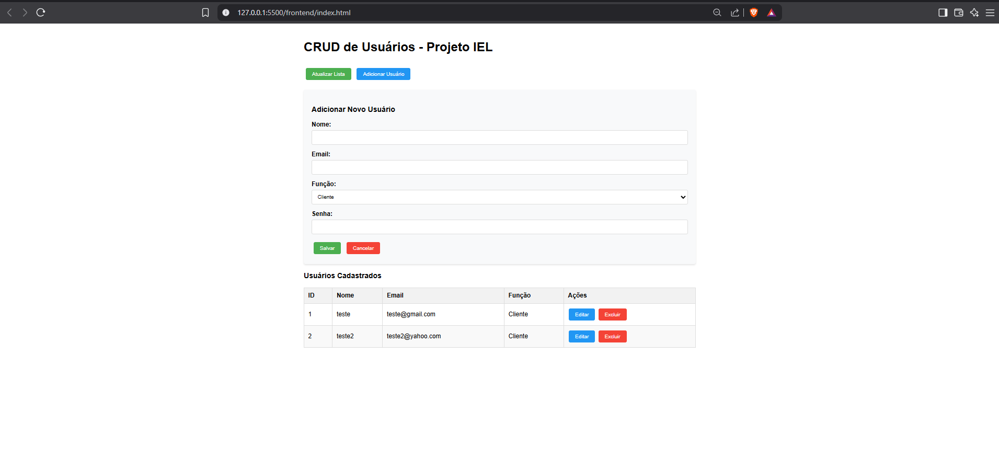

# Projeto Backend IEL

Este é um projeto backend desenvolvido para o curso IEL com as seguintes funcionalidades:

- API RESTful para gerenciamento de usuários
- Autenticação JWT
- Banco de dados SQLite
- Modelos: Usuários, Categorias, Produtos

## Tecnologias utilizadas
- Node.js
- Express
- Sequelize (ORM)
- SQLite

## Como executar
1. Clone o repositório
2. Instale as dependências: `npm install`
3. Configure o arquivo `.env`
4. Inicie o servidor: `npm start`

## Rotas principais
- `/api/users` - Gerenciamento de usuários

## Como testar a API

### Opção 1: Interface Web Completa (CRUD)
A interface agora inclui operações completas de Create, Read, Update e Delete (CRUD) para usuários.

1. Acesse a interface frontend: [https://janniofsantos.github.io/gtech2](https://janniofsantos.github.io/gtech2)
   interface frontend[https://janniofsantos.github.io/gtech2/frontend/](https://janniofsantos.github.io/gtech2/frontend/)
2. Inicie o servidor backend localmente:
```bash
npm start

```

3. abrir localmente pasta frontend e index.html com live server


**Funcionalidades disponíveis:**
- Listar todos os usuários
- Adicionar novo usuário
- Editar usuário existente
- Excluir usuário
- Visualização em tabela com ordenação
- Feedback visual para todas as operações
- Validação de formulários

A interface se conecta automaticamente à API em `http://localhost:3001`

### Opção 2: Clientes HTTP
1. Certifique-se que o servidor está rodando:
```bash
npm start
```

2. Use um cliente HTTP para testar as rotas:

#### Exemplo com curl:
```bash
# Listar todos os usuários
curl http://localhost:3001/api/users

# Criar novo usuário
curl -X POST http://localhost:3001/api/users \
  -H "Content-Type: application/json" \
  -d '{"name":"Novo Usuário","email":"novo@email.com","password":"senha123"}'

# Obter usuário por ID
curl http://localhost:3001/api/users/1
```


